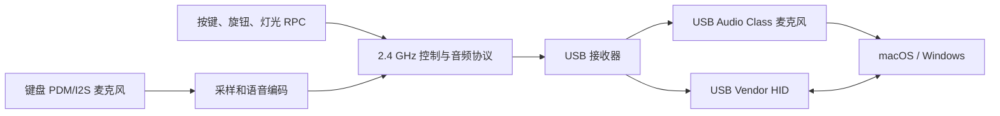
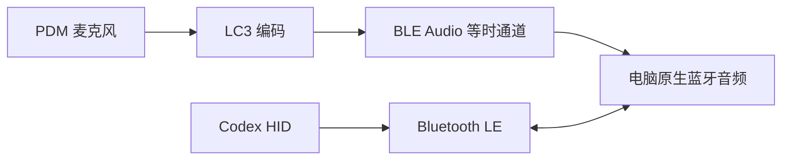

# 无线麦克风方案评估

更新日期：2026-07-25

## 评估前提

- 设备主要服务于 ChatGPT Desktop，macOS 优先，Windows 其次。
- 麦克风用于按住说话和短时间连续录音，不承担音乐播放或全双工耳机功能。
- 电脑侧应免安装常驻配套程序。
- 保留 Codex Micro 兼容 HID、BLE、原生 USB 和单节锂电池。
- 当前主控和验证平台为 ESP32-S3。

## 结论

如果必须让键盘在无线状态下使用自身麦克风，主线选择专用 2.4 GHz USB 接收器。
BLE Audio 作为研究支线保留，不作为第一版成品依赖。

推荐发布顺序：

1. v1：USB 有线时使用键盘麦克风；BLE 时使用电脑麦克风。
2. v1.5：增加可选 2.4 GHz USB 接收器，传输 HID 和麦克风音频。
3. Research：用 nRF5340 Audio DK 验证目标电脑的原生 BLE Audio 麦克风兼容性。

## 方案 A：专用 2.4 GHz USB 接收器

### 架构

键盘和接收器都可以使用 ESP32-S3。接收器向电脑呈现为复合 USB 设备：一个标准
UAC 麦克风接口加一个 Codex 兼容 Vendor HID 接口。电脑不需要知道无线协议。

### 建议传输策略

- 语音基线为单声道、16 kHz、16 bit；原始数据率约 256 kbit/s。
- 先用 IMA-ADPCM 一类低复杂度语音编码降低无线占用，接收器恢复为 PCM。
- 音频采用序号、时间戳和短抖动缓冲；过期音频包不重传，可选轻量冗余或丢包隐藏。
- HID/RPC 使用独立高优先级可靠队列，必须确认并重传，不能被音频流阻塞。
- 配对后保存唯一密钥，加入加密、随机数和重放保护。
- 插入接收器时优先使用 2.4 GHz；BLE 停止发送控制事件，避免重复输入和射频争用。
- 接收器将主机下发的 Agent 灯光状态反向转发给键盘。

ESP-NOW 可用于第一版无线台架。它默认 1 Mbit/s，v2.0 单包最多 1470 字节并支持
CCMP，但官方明确说明 MAC 层发送成功不等于应用层收到，而且过短发送间隔可能造成
回调次序问题。因此必须自行实现序号、确认、缓冲和丢包策略。正式版还要对比
ESP-NOW、Wi-Fi UDP 和专用 2.4 GHz 收发方案后再冻结。

### 优点

- 继续使用现有 ESP32-S3、固件和开发工具。
- USB UAC/HID 对电脑端最可控，绕开电脑蓝牙芯片和驱动差异。
- 同一个无线链路可以传音频、按键和灯光双向数据。
- 可以针对语音优化延迟、带宽和电池消耗。
- 接收器可以承担恢复烧录、日志和固件升级入口。

### 风险和代价

- 需要第二块 PCB、USB 外壳和另一套固件。
- 占用一个 USB 口，接收器可能丢失。
- 需要自行处理配对、抗干扰、抖动、丢包、加密和版本兼容。
- ESP32-S3 的 Wi-Fi 类 2.4 GHz 传输功耗高于普通 BLE HID；应只在录音期间开启高吞吐。
- 音频流和灯光/RPC 的压力测试工作量明显增加。

## 方案 B：原生 BLE Audio

### 架构

真正的 BLE Audio 依赖 Bluetooth Core 5.2 引入的 LE Isochronous Channels，并使用
LC3 和相关音频 Profile。ESP32-S3 是 Bluetooth 5.0 LE 平台，不具备这条完整路线，
因此不能只靠固件升级实现。

可行的验证平台是 Nordic nRF5340。它支持 LE Audio、PDM/I2S、USB 2.0 Full Speed，
Nordic 的 Audio DK 可作为 USB dongle、音频终端或耳机参考平台。

### 两种实现方式

| 方式 | 结果 | 问题 |
| --- | --- | --- |
| nRF5340 直接连接电脑 BLE Audio | 无接收器 | 强依赖电脑蓝牙硬件、系统和驱动支持 |
| 两块 nRF5340 Audio DK，其中一块作 USB 网关 | 兼容性更可控 | 最终仍然是“带接收器”的方案，成本和复杂度更高 |

### 优点

- 标准化音频链路，LC3 为低码率和低功耗设计。
- 理想条件下无需专用接收器。
- 音频时序、QoS 和等时传输由标准协议栈处理。
- 适合后续扩展成完整无线音频产品。

### 风险和代价

- 需要把主控迁移到 nRF5340，或增加第二颗无线 SoC。
- Codex HID、USB、RGB、矩阵、电池和升级代码都要移植到 Nordic/Zephyr 生态。
- LE Audio 的 Profile、LC3、等时通道和配对调试门槛远高于普通 BLE HID。
- Windows 官方明确说明并非所有 Windows 11 电脑都支持 LE Audio，还依赖出厂硬件和
  厂商驱动。目标 macOS 的第三方 BLE Audio 麦克风也必须实机验证，不能由规格推断。
- 若为了兼容性再配一只 Nordic USB 网关，会失去“无接收器”的主要优势。

## 对比

| 维度 | 专用 2.4 GHz 接收器 | 原生 BLE Audio |
| --- | --- | --- |
| 复用 ESP32-S3 | 高 | 低 |
| macOS/Windows 免驱确定性 | 高，电脑只看到 USB UAC/HID | 中低，取决于蓝牙硬件、系统和驱动 |
| 无需接收器 | 否 | 理论上是 |
| 固件开发难度 | 中高 | 很高 |
| PCB 工作量 | 键盘加接收器两块 PCB | 更换主控或双 SoC |
| 低功耗潜力 | 中 | 高 |
| 调试可控性 | 高 | 中低 |
| 第一版成功概率 | 较高 | 较低 |
| 长期标准化 | 私有协议 | 强 |

## 决策门槛

在改变主 PCB 前进行两个独立实验：

1. ESP32-S3 双板台架：发送模拟或录制的 16 kHz 单声道音频，接收端输出 USB UAC，
   同时往返传输 Codex HID/RPC；记录丢包、端到端延迟和录音电流。
2. nRF5340 Audio DK 台架：直接连接目标 Mac 和 Windows 电脑，确认能否被识别为可用
   的输入麦克风，并验证与 BLE HID 同时工作。

若实验 1 达标，进入 2.4 GHz 接收器 v1.5。实验 2 只有在目标电脑原生兼容、无接收器
价值明确且移植成本可接受时，才允许替换主控架构。
