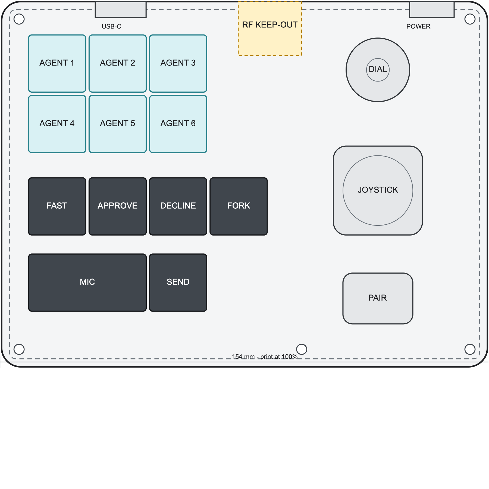
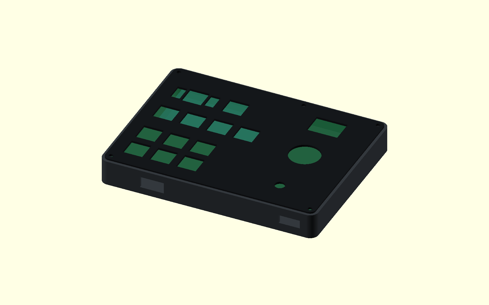
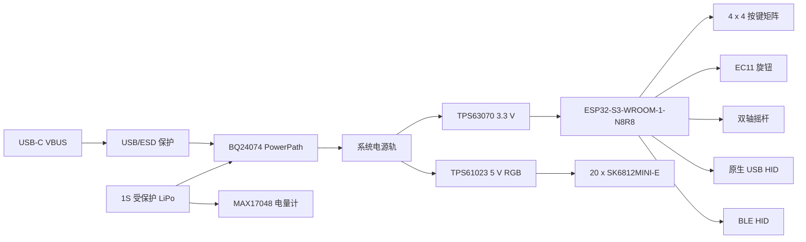

# Codex Console Alpha Rev A

本目录是第一版集成样品的设计基线。目标不是一次量产成功，而是用一套可装配的
PCB、外壳和真实控件同时验证功能、手感、灯光、电源和装配。

## 已冻结的产品方向

| 项目 | Rev A 决策 |
| --- | --- |
| 外壳外形 | 154 x 116 mm，圆角桌面控制台 |
| 主 PCB | 148 x 110 mm，4 层，1.6 mm，优先 SMT 贴片 |
| 按键 | 12 个 MX 热插拔轴，PCB 同时兼容 3 脚和 5 脚，19.05 mm 间距 |
| 键帽 | XDA 等高；6 个磨砂半透明 1U Agent，5 个深灰 1U Command，1 个深灰 2U Mic |
| 轴体 | Alpha 默认 Gateron G Pro 3.0 Brown，透明上盖、5 脚；热插拔允许后续替换 |
| Mic 稳定器 | PCB 安装 2U 螺丝卫星轴 |
| 旋钮 | Alps Alpine EC11E15244G1，30 段、15 脉冲、带按压、20 mm D 轴 |
| 摇杆 | Alps Alpine RKJXV122400R，回中双轴、10 kOhm、带中心按压 |
| 主控 | ESP32-S3-WROOM-1-N8R8 |
| 连接 | BLE HID + 原生 USB 2.0 Full Speed，USB 有线优先 |
| 灯光 | 12 个按键灯 + 8 个边缘灯，共 20 个 SK6812MINI-E |
| 电池 | 预留受保护 1S 604070 LiPo，最大包络 70 x 40 x 7 mm，JST-PH 2.0 |
| 充电 | BQ24074 PowerPath，允许插线使用和充电 |
| 板载麦克风 | 预留 PDM 器件和声孔，Rev A 默认 DNP，不启用 USB Audio |

Mic 键在 Rev A 中继续调用电脑麦克风。这保持与已经验证的 Codex Micro HID 行为
一致。板载麦克风只有在 USB Audio 复合设备和无线语音方案分别验证后才装配。
Rev A 不集成专用 2.4 GHz 接收器，也不承诺 BLE Audio；两者继续作为后续独立版本，
不阻塞当前 BLE HID + USB 样品。

## 电气构成

## 坐标和堆叠

- 所有平面坐标以外壳左上角为 `(0, 0)`，单位为 mm。
- PCB 位于外壳内侧，每边留 3 mm。
- PCB 下方预留 9 mm 电池层，并使用绝缘电池托盘隔开热插拔轴座和电芯。
- MX 定位板到 PCB 的名义距离为 5.0 mm，定位板厚 1.5 mm。
- 外壳主体高度 18 mm；键帽和旋钮露出主体，不计入 18 mm。
- 后边缘布置 USB-C、电源开关和模块天线区域；天线前方及上下层不得放置金属。

## 文件

- `layout.svg`：154 x 116 mm 的 1:1 顶视布局，可按 100% 比例打印。
- `enclosure.scad`：参数化底壳、定位板、孔位和占位体。
- `placement.csv`：控件中心和机械包络，PCB 与外壳共用。
- `mechanical-placement.kicad_pcb`：四层 PCB 板框、安装孔、控件包络和天线/电池区的
  KiCad 机械基线；它不是已布线生产板。
- `mechanical-placement-preview.png`：KiCad 机械基线的独立导出预览。
- `lceda/Codex Console Rev A.eprj2`：嘉立创 EDA 专业版 V3.2.166 的正式本地工程；
  原理图和 PCB 将以此为后续主设计文件。
- `net-map.csv`：GPIO、矩阵和主要网络分配。
- `pcb-rules.md`：四层板、电源、USB、天线和可制造性约束。
- `bom.csv`：Rev A 关键电气与机械 BOM；小阻容在原理图完成时补齐数值。
- `sources.md`：关键芯片与控件的原厂资料入口。
- `procurement.zh-CN.md`：机械样品、PCBA 物料和电池的分批下单边界。
- `release-checklist.zh-CN.md`：PCB 下单和外壳打印前必须关闭的 P0 检查项。

## 当前完成度

机械基线已使用 KiCad 10.0.5 执行 DRC，结果为 0 条违规、0 个未连接项；参数外壳已
使用 OpenSCAD 2021.01 完成编译渲染。这里的 DRC 只证明板框、安装孔和机械图层合法，
不代表尚未绘制的电路已经通过验证。

这是可用于原理图捕获和结构样件的 Rev A 基线，还不是可以直接发板的生产包。发板前
必须完成：正式 KiCad 原理图、封装核对、ERC、PCB 布线、DRC、Gerber/钻孔复查、
3D 干涉检查和电池极性复核。第一次只投 5 片 PCB 和 2 套打印外壳。
